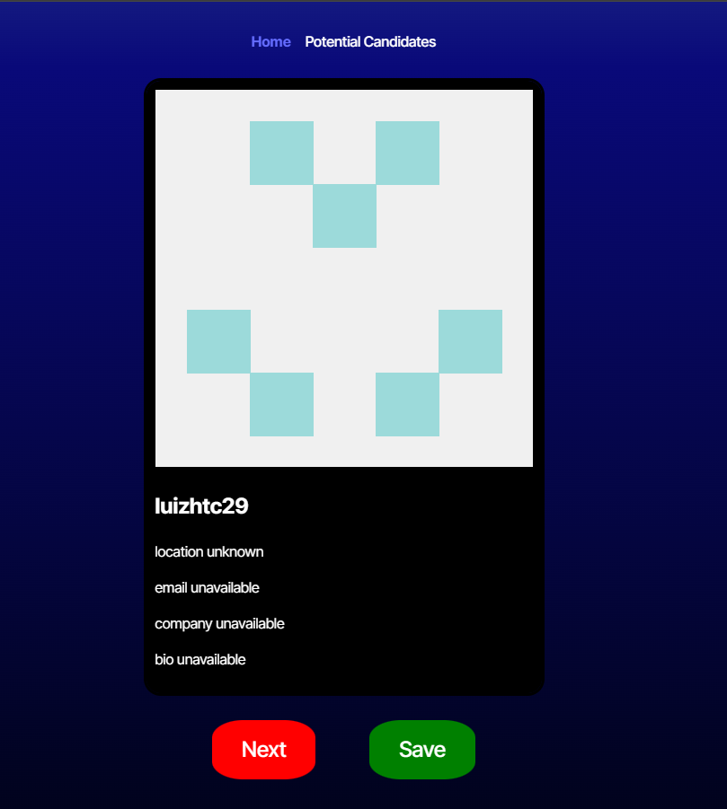

# ReactCandidateSelector

This application utilizes React to create a "Tinder for developers". Functionality is allowing a user to see a list of potential candidates for a job posting. This list is from GitHub (using an API). The user can then save any candidates they like, and view that saved list on a 2nd page (Potential Candidates). 

[deployed app](https://reactcandidateselector-1.onrender.com)

## Table of Contents
- [Installation](#installation)
- [Usage](#usage)
- [Contributing](#contributing)
- [Tests](#tests)
- [Questions](#questions)

## Installation

## Usage

## Contributing
Please create your own branch

## Tests

## Questions

If you have any questions, please reach out to me at 
[jensenbret13@gmail.com](mailto:jensenbret13@gmail.com).
GitHub: [bretaj](https://github.com/bretaj)

